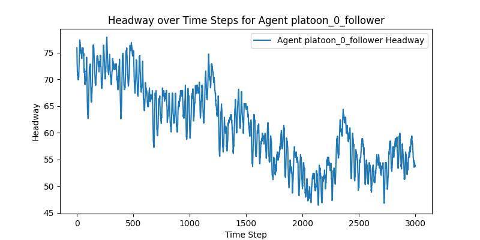
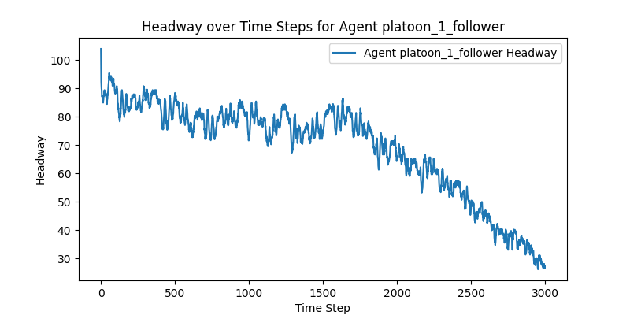
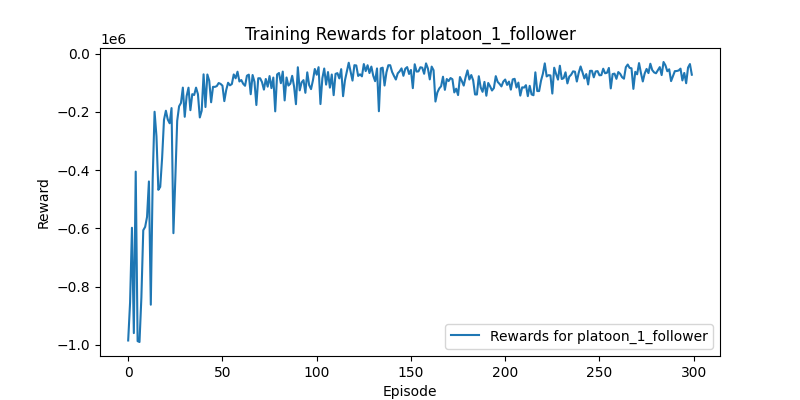
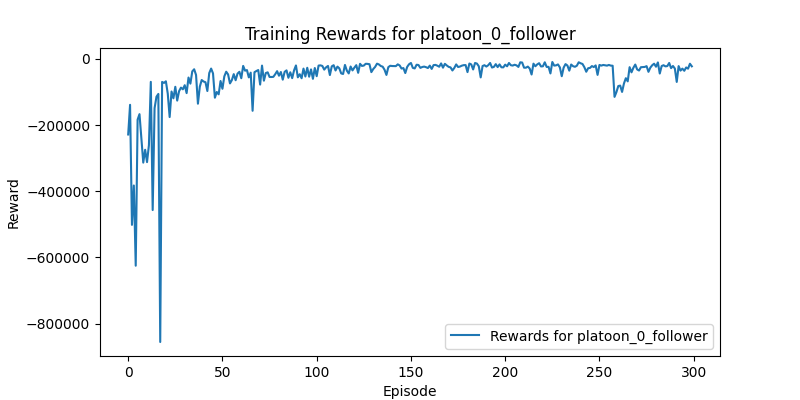
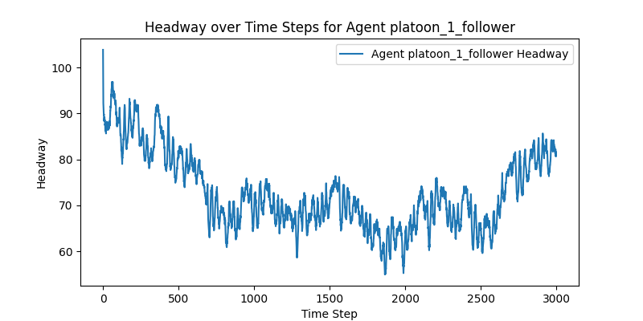

# Reinforcement Learning-Based Traffic Optimization Using Platoons

---

## **Project Overview**

This project addresses the growing demand for efficient and sustainable traffic management in urban environments. Using a novel approach that combines **Reinforcement Learning (RL)** and **hierarchical clustering**, the project enhances vehicular traffic flow, optimizes fuel efficiency, and reduces congestion. The primary innovation lies in the use of **multi-agent RL systems** for controlling vehicle platooning dynamics in a simulated urban environment, implemented using the **Simulation of Urban MObility (SUMO)** tool.

---

## **Motivation**

Modern urban areas face numerous challenges due to:
1. Increasing traffic congestion.
2. Inefficient traffic light systems.
3. High fuel consumption and emissions.
4. Frequent traffic delays.

To tackle these issues, we integrate **platooning models** (grouping vehicles for coordinated movement) with advanced machine learning techniques. The project simulates traffic scenarios and optimizes vehicle movements using reinforcement learning to ensure adaptive and dynamic decision-making.

---

## **Features**
1. **Hierarchical Clustering**:
   - Groups vehicles into cohesive clusters (platoons) based on speed, proximity, and trajectory.
   - Enables real-time decision-making for traffic optimization.
   
2. **Reinforcement Learning**:
   - Employs **Deep Q-Networks (DQN)** for vehicle control.
   - Focuses on maintaining headway, optimizing speed, and reducing emissions.

3. **SUMO Simulation**:
   - Provides a realistic testing ground for traffic optimization strategies.
   - Includes real-time feedback for continuous learning and adaptability.

4. **Environmental Benefits**:
   - Reduces fuel consumption and emissions by minimizing stop-and-go traffic patterns.
   - Improves urban mobility and sustainability.

---

## **System Design**

### 1. **Clustering Vehicles into Platoons**
The hierarchical clustering algorithm groups vehicles based on proximity, speed, and direction. Vehicles within a cluster form a **platoon**. Each platoon has:
- A **leader vehicle** responsible for guiding the group.
- **Follower vehicles** maintaining optimal distance and speed.

### 2. **Reinforcement Learning for Control**
Using a **multi-agent RL system**, vehicles:
- Learn to maintain optimal headway (distance between vehicles).
- Respond to real-time traffic changes.
- Adjust speed and acceleration dynamically.

### 3. **SUMO Environment**
**SUMO** acts as the simulation platform, enabling:
- Integration of real-world traffic scenarios.
- Simulation of complex traffic patterns with thousands of vehicles.
- Evaluation of RL models under varying conditions.

---

## **Clustered Vehicles Table**

The table below provides a sample of clustered vehicles, including their **Vehicle ID**, **Speed**, and **Proximity to Leader**.

| **Cluster** | **Vehicle ID** | **Speed (m/s)** | **Proximity to Leader (m)** |
|-------------|----------------|-----------------|-----------------------------|
| Platoon 0   | V101           | 20.5            | 5.2                         |
| Platoon 0   | V102           | 20.8            | 6.1                         |
| Platoon 0   | V103           | 21.0            | 7.0                         |
| Platoon 1   | V201           | 18.2            | 4.8                         |
| Platoon 1   | V202           | 18.5            | 5.4                         |
| Platoon 1   | V203           | 18.7            | 6.0                         |

These values demonstrate how vehicles are grouped into cohesive units based on their dynamic attributes, enabling efficient and safe platooning behavior.

---

## **Project Workflow**

### **1. Data Clustering**
Vehicles are clustered using hierarchical clustering techniques. The clustering helps form **platoons** based on dynamic parameters:
- **Speed**: Ensures uniform speed within a platoon.
- **Proximity**: Reduces headway while maintaining safety.
- **Direction**: Groups vehicles moving in the same direction.

### **2. Training RL Models**
The RL model is trained using SUMO simulation with the following components:
- **State Space**: Speed (`vt`) and headway (`ht`).
- **Action Space**: Acceleration, deceleration, or maintaining speed.
- **Reward Function**: Penalizes unsafe or inefficient behavior and rewards actions that improve traffic flow and reduce congestion.

### **3. Simulation and Testing**
SUMO simulations validate the RL strategies:
- **Single Platoon Scenario**: Optimizes one platoon in isolation.
- **Multiple Platoon Scenario**: Tests interactions between several platoons.

---

## **Graphs and Visualizations**

### **Headway Analysis**
#### Platoon 0 Follower
This graph shows the headway (distance between vehicles) for a follower vehicle in **Platoon 0**. The RL model ensures the headway stays within safe and optimal limits over time.



---

#### Platoon 1 Follower
Similar to Platoon 0, this graph depicts the headway dynamics for **Platoon 1**. RL effectively manages vehicle spacing.



---

### **Rewards Over Training**
#### Platoon 0 Follower
The reward function evaluates the agent's performance. The graph shows how the RL model improves with training episodes, achieving better rewards as it learns optimal traffic control strategies.



---

#### Platoon 1 Follower
Training rewards for Platoon 1 show similar improvement trends. The RL agent adapts to traffic scenarios over time.



---

### **Modified Headway**
This graph compares the original and modified headway, demonstrating the RL model's capability to improve spacing consistency and safety within platoons.



---

## **Technical Details**

### **Algorithms**
1. **Hierarchical Clustering**:
   - Groups vehicles based on similarity metrics like speed and direction.
   - Produces dendrograms to visualize cluster hierarchies.

2. **Deep Q-Network (DQN)**:
   - Trains vehicles to make decisions in real-time.
   - Uses the **epsilon-greedy policy** for exploration and exploitation.

### **SUMO Configuration**
- **Root File**: Defines vehicle routes and timings.
- **Network File**: Models the road layout and traffic control systems.
- **Configuration File**: Centralizes simulation settings.

---

## **Results**
- **Traffic Flow**: Reduced congestion and improved movement through intersections.
- **Fuel Efficiency**: Optimized platooning reduced unnecessary accelerations and braking.
- **Safety**: Maintained consistent and safe headway between vehicles.

---

## **How to Run the Project**

1. **Install SUMO**:
   - Follow the official installation guide: [SUMO Documentation](https://www.eclipse.org/sumo/).

2. **Clone the Repository**:
   ```bash
   git clone https://github.com/antonyjalappat/traffic-optimization.git
   cd traffic-optimization
